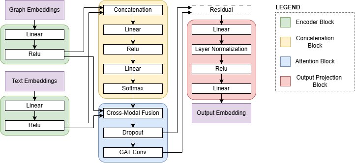

# RAG-Enhanced Subreddit Response Modeling

This project explores how **Retrieval-Augmented Generation (RAG)** can be used to generate more context-aware responses in subreddit communities using document-enhanced language models.

Specifically, we evaluate how different graph-based and attention-based embedding methods—such as Node2Vec, GNN embeddings, and attention fusion—affect the quality and usefulness of retrieved documents when answering questions about posts from two Reddit communities: [`r/Silksong`](https://www.reddit.com/r/Silksong/) and [`r/AITAH`](https://www.reddit.com/r/AmItheAsshole/).

The final model architecture:

## 🧩 What This Project Does

- Embeds Reddit comments using a base sentence transformer
- Enhances those embeddings using different techniques:
  - Node2Vec (graph-based)
  - GNN Embeddings
  - Simple and Enhanced Attention Fusion
- Uses similarity search to retrieve relevant documents
- Feeds those documents to an LLM via a RAG pipeline to generate informed answers
- Visualizes embedding quality using t-SNE and hexbin plots
- Compares loss curves and training times across models

Please see `./reports` for a full report.

## ⚙️ Setup
- Please setup an `OPENAI_API_KEY` in your system path.
- This project is built with the following libraries
  - Torch version: 2.6.0+cu126
  - CUDA version: 12.6
  - NetworkX version: 3.4.2

## 📁 Custom Data
Datasets of subreddit comments are downloaded from (this)[https://academictorrents.com/details/1614740ac8c94505e4ecb9d88be8bed7b6afddd4/tech&filelist=1] database. Often these files do not have a file extension on the end. They can be in either JSON or ZST format. Place these files in `./data/raw` when downloaded. Please use the script in `./notebooks/check_data_format.ipynb` to find this out.
---